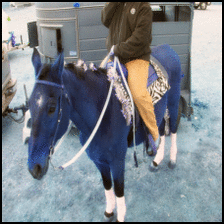
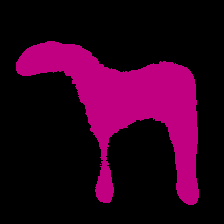
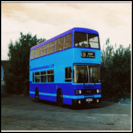
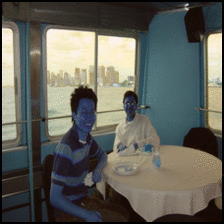

# Laplacian Refinement and Reconstruction Network for Semantic Segmentation 

This repository contains code and models for the algorithm described in:

[Golnaz Ghiasi, Charless C. Fowlkes, "Laplacian Pyramid Reconstruction and
Refinement for Semantic Segmentation", ECCV 2016](http://arxiv.org/abs/1605.02264)

## Team Members
* Ashutosh Mishra
* Shyam Nandan Rai
* Murtuza Bohra

## Installation

### Requirements
* Pytorch >= 0.3.0
* Torchvision ==0.2.0
* Jupyter Notebook

#### Datset 
* VOC 2012 

#### Pre-trained models
* Pre-trained model 32x [[here]](https://drive.google.com/open?id=12Anxqrr4-3tg_TAPHImdPv8cgk6LX_oN)
* Pre-trained full model [[here]](https://drive.google.com/open?id=15DLqN3e6aCxXI81DQGu2oiWdJnOgeSl4)

#### Example of Results

## Usage

* To use pre-trained model, download using the link provided above and store it in folder named  "Model". You can now view these models using visualization notebooks.
* For training the model just, run LRRVGG16 Notebook.

## Contributing
Pull requests are welcome. For major changes, please open an issue first to discuss what you would like to change.

## License
[MIT](https://choosealicense.com/licenses/mit/)
